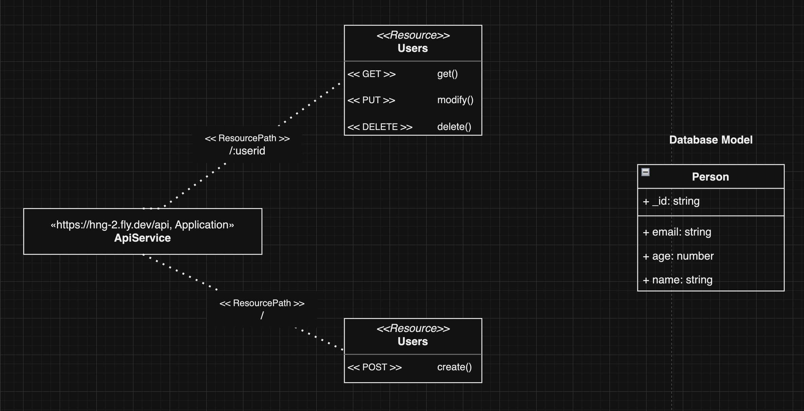

# API Documentation

This documentation provides an overview of how to use the Person API, including setup instructions, request/response formats, and sample usage.

## Table of Contents
- [Setup](#setup)
- [Endpoints](#endpoints)
  - [Get Person](#get-person)
  - [Update Person](#update-person)
  - [Create Person](#create-person)
  - [Delete Person](#delete-person)
- [Request and Response Formats](#request-and-response-formats)
- [Sample Usage](#sample-usage)
- [Testing](#testing)

---

## Setup

1. Clone the repository to your local environment:
2. Install the required dependencies:
3. Configure your environment variables if needed, such as database connection details.
4. Start the server:
   
The API will be available at `http://localhost:<port>`, where `<port>` is the port number you have configured.

---

## Endpoints

### Get Person

- **URL:** `/api/person/:id`
- **Method:** `GET`
- **Description:** Retrieve information about a specific person by their ID.

### Update Person

- **URL:** `/api/person/:id`
- **Method:** `PUT`
- **Description:** Update the information of a specific person by their ID.

### Create Person

- **URL:** `/api/person`
- **Method:** `POST`
- **Description:** Create a new person with the provided information.

### Delete Person

- **URL:** `/api/person/:id`
- **Method:** `DELETE`
- **Description:** Delete a person by their ID.

---

## Request and Response Formats

### Request

For `PUT` and `POST` requests, send a JSON object in the request body with the following properties:
- `name` (string): The name of the person.
- `email` (string): The email address of the person.
- `age` (number): The age of the person.

### Response

The API responds with JSON objects that contain person information in the following format:

```json
{
"_id": "unique_id",
"name": "Person Name"
}
```

## Sample Usage
### Get Person

**Request:**

```http
GET /api/person/123
```

**Response**
```json
{
  "_id": "123",
  "name": "John Doe"
}
```

### Update Person
**Request**
```http
PUT /api/person/123
Content-Type: application/json

{
  "name": "Updated Name"
}
```
**Response**
```json
{
  "_id": "123",
  "name": "Updated Name"
}
```

### Create Person
**Request**
```http
POST /api/person
Content-Type: application/json

{
  "name": "New Person"
}
```
**Response**
```json
{
  "_id": "456",
  "name": "New Person"
}
```

### Delete Person
**Request**
```http
DELETE /api/person/123
```

**Response**
```
HTTP/1.1 204 No Content
```

## Testing
Run the command below to test the endpoints. Make sure the `MONGO_TEST_URI` environment is set
```bash
yarn test
```

## UML and ER diagram

